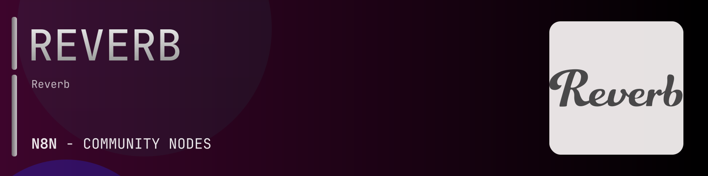

# @n8n-dev/n8n-nodes-reverb



[](https://www.npmjs.com/package/@n8n-dev/n8n-nodes-reverb)
[](https://opensource.org/licenses/MIT)

---

**Stop writing reverb API integrations by hand.**

Every time you connect n8n to reverb, you waste hours mapping endpoints, defining parameters, and debugging schemas. You copy-paste from docs, fix edge cases, and pray nothing breaks.

**What if connecting n8n to reverb took 5 minutes, not half a day?**

This node gives you **23+ resources** out of the box: **Articles**, **Categories**, **Comparison Shopping Pages**, **Conversations**, **Countries**, and 18 more: with full CRUD operations, typed parameters, and zero manual configuration.

---

## What You Get

- **Zero boilerplate**: Resources, operations, and fields are pre-configured and ready to use
- **Full CRUD**: Create, read, update, and delete support where the API allows it
- **Typed parameters**: No more guessing field types
- **Built-in auth**: API key authentication, ready to go
- **Declarative**: Native n8n performance, no custom execute() overhead

---

## Install

```bash
npm install @n8n-dev/n8n-nodes-reverb
```

**Or in n8n:**
1. **Settings → Community Nodes → Install**
2. Search: `@n8n-dev/n8n-nodes-reverb`
3. Click **Install**

---

## Quick Start

1. Install the node (above)
2. Add credentials: **reverb API** → paste your API key
3. Drag the **reverb** node into your workflow
4. Pick a resource → pick an operation → done.

That's it. No configuration files. No code. It just works.

---

## Resources

<details>
<summary><b>Articles</b> (2 operations)</summary>

- Get Articles
- Get List of all article categories

</details>

<details>
<summary><b>Categories</b> (3 operations)</summary>

- Get List of supported product categories
- Get Categories Flat
- Get Full taxonomy tree of categories including middle categories

</details>

<details>
<summary><b>Comparison Shopping Pages</b> (4 operations)</summary>

- Get Returns a set of comparison shopping pages based on the current params
- Get Show comparison shopping page
- Get Return new or used listings for a comparison shopping page
- Get View reviews of a comparison shopping page

</details>

<details>
<summary><b>Conversations</b> (1 operations)</summary>

- Post Make an offer to the other participant in the conversation

</details>

<details>
<summary><b>Countries</b> (1 operations)</summary>

- Get Retrieve a list of country codes with corresponding subregions

</details>

<details>
<summary><b>Csps</b> (3 operations)</summary>

- Get Returns a set of comparison shopping pages based on the current params
- Get Csps Categories
- Get Show comparison shopping page

</details>

<details>
<summary><b>Curated Sets</b> (1 operations)</summary>

- Get Curated Sets

</details>

<details>
<summary><b>Currencies</b> (2 operations)</summary>

- Get List of supported display currencies for browsing listings
- Get List of supported listing currencies for shops

</details>

<details>
<summary><b>Feedback</b> (1 operations)</summary>

- Get Feedback details

</details>

<details>
<summary><b>Handpicked</b> (1 operations)</summary>

- Get results from a handpicked collection

</details>

<details>
<summary><b>Listing Conditions</b> (1 operations)</summary>

- Get List of supported product conditions

</details>

<details>
<summary><b>Listings</b> (19 operations)</summary>

- Get Default search of listings includes only used handmade Add a filter to view all listings or use the listings all endpoint
- Post Create a listing
- Get All listings including used handmade and brand new
- Get Individual facets
- Get Returns the latest negotiation for the requesting user given a listing ID
- Post Make an offer to the seller of a listing
- Get View available bump tiers and stats for a listing
- Post Bump a listing
- Post Start a conversation with a seller
- Get View the images associated with a particular listing
- Delete an image from a listing
- Get See all sales that include a listing
- Delete a draft listing Cannot be used on non drafts
- Put Update a listing
- Get Edit listing
- Post Flag a listing for inappropriate content or fraud
- Get View reviews of a listing
- Post Create a review for a listing
- Get Listing details

</details>

<details>
<summary><b>My</b> (75 operations)</summary>

- Get account details
- Put Update account details
- Get See all addresses in your address book
- Post Create a new address in your address book
- Delete an existing address in your address book
- Put Update an existing address in your address book
- Get a list of your conversations
- Post Start a conversation
- Post Send a message
- Put Mark a conversation read unread
- Get your actionable status counts
- Delete My Curated Set Product
- Post My Curated Set Product
- Get listings from your feed
- Get your feed customization options
- Get your feed
- Get List of received feedback
- Get List of sent feedback
- Get See what the user is following
- Get Returns a user s ArticleCategoryFollows
- Post Set a user s ArticleCategoryFollows
- Delete Unfollow a brand
- Get Follow status for a brand
- Post Follow a brand
- Delete Unfollow a subcategory
- Get Follow status for a subcategory
- Post Follow a subcategory
- Delete Unfollow a collection
- Get Follow status for a collection
- Post Follow a collection
- Delete Unfollow a handpicked collection
- Get Follow status for a handpicked collection
- Post Follow a handpicked collection
- Get Follow status for a search
- Post Follow a search
- Delete Unfollow a shop
- Get Follow status for a shop
- Post Follow a shop
- Delete a follow
- Delete My Follows Alert
- Post My Follows Alert
- Get Retrieve a list of live listings for the seller To search all listings specify state all
- Get Retrieve a list your draft listings
- Get a list of active negotiations as a seller
- Put End a listing
- Get a list of your lists wishlist watch list etc
- Get a list of active negotiations as a buyer
- Get offer details
- Post Accept an offer
- Post Counter an offer
- Post Decline an offer
- Get List of orders that need feedback
- Get Returns all orders newest first
- Get My Orders Buying By Uuid
- Get Returns unpaid orders newest first
- Get Returns order details for a buyer
- Post Marks an order as received by the buyer
- Get all seller orders newest first
- Get unpaid seller orders newest first
- Get See previous orders from buyer
- Get My Orders Selling By Uuid
- Get unpaid seller orders newest first
- Get Returns order details for a seller
- Post Marks an order as picked up
- Post Marks an order as shipped
- Post Initiate a refund for a sold order
- Get payments
- Get a list of payouts
- Get Read the line items of a payout
- Get a list of refund requests as a seller
- Put Update a refund request for a sold order
- Get a list of your recently viewed listings
- Get a list of wishlisted items
- Delete Remove a listing from your wishlist
- Put Add a listing to your wishlist

</details>

<details>
<summary><b>Orders</b> (4 operations)</summary>

- Get Feedback details for an order s buyer
- Post Add feedback about an order s buyer
- Get Feedback details for an order s seller
- Post Add feedback about an order s seller

</details>

<details>
<summary><b>Payment Methods</b> (1 operations)</summary>

- Get list of payment methods

</details>

<details>
<summary><b>Priceguide</b> (1 operations)</summary>

- Get a summary of transactions for a given price guide

</details>

<details>
<summary><b>Products</b> (3 operations)</summary>

- Get View a review
- Put Update a review
- Post Create a review for a product

</details>

<details>
<summary><b>Sales</b> (5 operations)</summary>

- Get View upcoming and live Reverb official sales
- Get View your created sales
- Delete Remove a listing from a sale
- Post Add listings to a sale
- Get Sales

</details>

<details>
<summary><b>Shipping</b> (2 operations)</summary>

- Get List of supported shipping providers
- Get Shipping Regions

</details>

<details>
<summary><b>Shop</b> (7 operations)</summary>

- Get your own shop details
- Put Update your shop profile
- Get List of supported product conditions
- Get accepted payment methods
- Delete Disable vacation mode All listings will be re enabled
- Get Returns shop vacation status
- Post Enable vacation mode All listings will be unavailable until vacation mode is turned off

</details>

<details>
<summary><b>Shops</b> (6 operations)</summary>

- Get storefront details on a shop
- Get List of shipping profiles for your shop
- Get details on a shop
- Get seller s feedback
- Get seller s feedback as a buyer
- Get seller s feedback as a seller

</details>

<details>
<summary><b>Wants</b> (3 operations)</summary>

- Get A list of wanted items by the user
- Delete Unmark an item wanted
- Put Mark an item wanted Returns 200 on success or 422 on failure

</details>

<details>
<summary><b>Webhooks</b> (3 operations)</summary>

- Get WEBHOOK registrations
- Post Register a WEBHOOK
- Delete Remove a WEBHOOK

</details>

---

## Why This Node?

**Without this node:**
- Hours of manual API integration
- Copy-pasting from reverb docs
- Debugging auth, pagination, error handling
- Maintaining your own client code

**With this node:**
- Install → configure → use. 5 minutes.
- Auto-generated from the official reverb OpenAPI spec
- Always up to date when the API changes
- Native n8n performance

---

## Auto-Generated
This node was auto-generated from the official **reverb** OpenAPI specification using
[@n8n-dev/n8n-openapi-node-ultimate](https://github.com/kelvinzer0/n8n-openapi-node-ultimate),
then validated against the live API so you get accurate types and real parameters, not guesswork.

When the reverb API updates, this node updates too.

---

## Support This Project

If this node saved you hours of work, consider supporting continued development, new APIs, better error handling, and faster updates.

[](https://n8n-code.github.io/membership/#/eyJ0aXRsZSI6IktlZXAgSXQgTW92aW5nIiwiZGVzYyI6Ik9uZSBkZXZlbG9wZXIgYnVpbHQgYSB0b29sIHRoYXQgYXV0by1nZW5lcmF0ZXNcbm44biBub2RlcyBmcm9tIGFueSBPcGVuQVBJIHNwZWMuXG5cbllvdXIgZG9uYXRpb24gZnVuZHMgbmV3IGZlYXR1cmVzLCBtb3JlIEFQSSBzdXBwb3J0LFxuYW5kIGJldHRlciB0b29saW5nIGZvciBldmVyeSBkZXZlbG9wZXIgYWZ0ZXIgeW91LiIsInRhcmdldCI6NTAwMCwiYWRkcmVzc2VzIjp7ImV0aGVyZXVtIjoiMHhmMDU1NWQ0MGRiRkI0ZTNCZjA3MDQ0MjgyQjc4RjJmRTFmNTFFZjcyIiwic29sYW5hIjoiNlpEVk5BYmpZZExEcXo4cGt3VUNHYllaNVV3QlFranB0QzU1Wk5vTFcybVUifSwiZGlzY29yZCI6Imh0dHBzOi8vZGlzY29yZC5nZy9wdERaOGU0aDkzIn0)

---

## License

MIT © [kelvinzer0](https://github.com/n8n-code)
